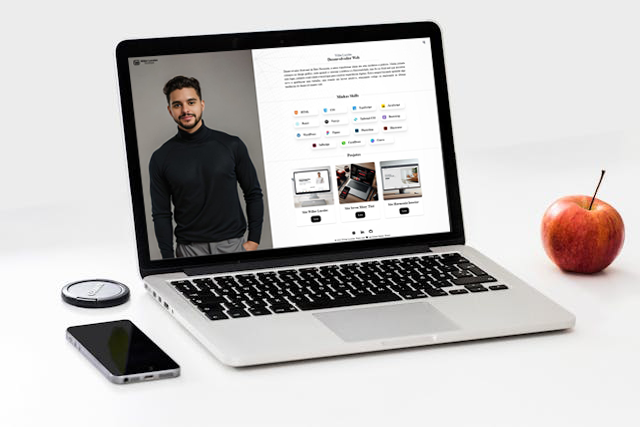

# Desafio de Apresentação Pessoal - Processo Seletivo Frontend Fusion - [cargo voluntário]

## Sobre o Projeto

Olá, este é o meu projeto criado para o desafio de apresentação pessoal do processo seletivo do projeto Frontend Fusion para a vaga de Desenvolvedor React Júnior. Este projeto foi desenvolvido para demonstrar minhas habilidades em desenvolvimento com React.

## Tecnologias Utilizadas

- **React**
- **Vite**
- **Tailwind CSS**
- **Framer Motion**

## Redes Sociais

- [LinkedIn](https://www.linkedin.com/in/willerlucoles)
- [GitHub](https://github.com/willerlucoles)

Espero que gostem do projeto!